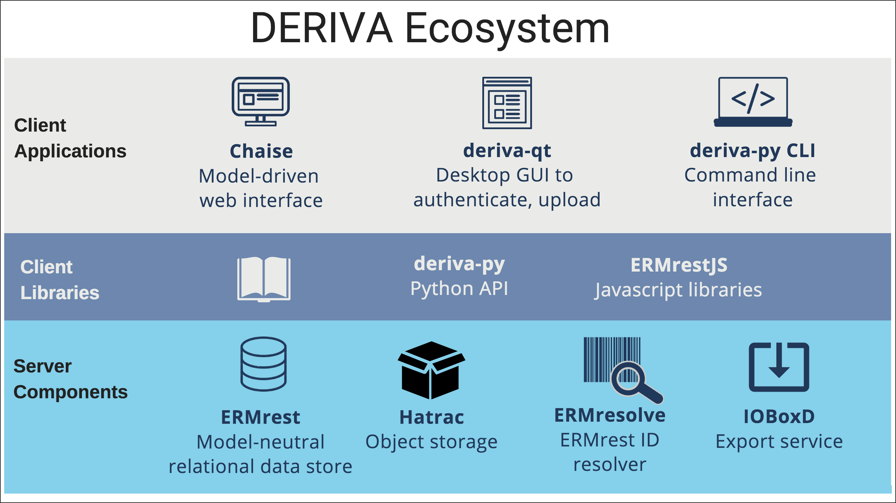

# DERIVA Architecture

* At DERIVA's core are a suite of **server components** that store the data, describe the data model, represent the data and provide exporting capabilities.
* APIs and other **client libraries** allow programmers and bioinformaticians integration with other tools and applications.
* For end users, **client applications** offer:
    1. a web interface that represents the data, data model and filtering/search capabilities for discovering data; 
    2. a desktop GUI that data submitters can use to authenticate with the deployment and upload data files; and,
    3. a command line interface for interacting with the data.

