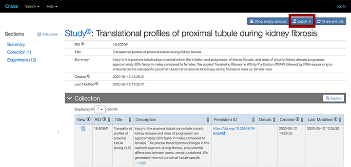
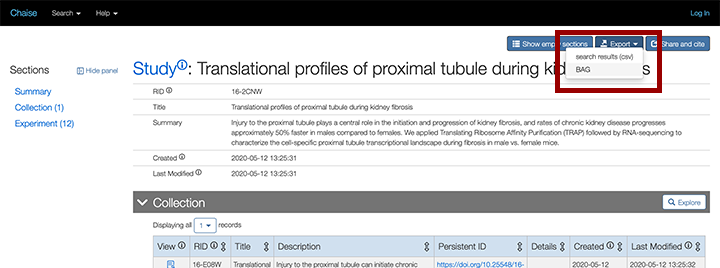
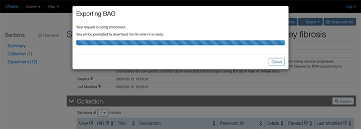
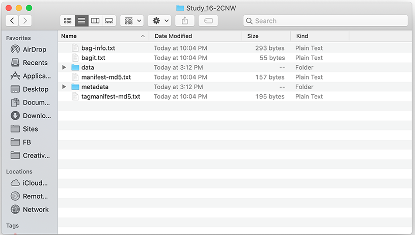
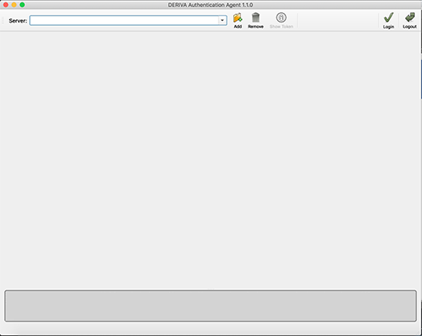

# Exporting Data

Available data files may be downloaded individually by clicking each link.

However, if there are many files or they are very large or if you want to export them to a remote cluster/server, you will need to export a "BDBAG" of content that represents information about the files, including their locations, and then use our tool to download (ie, materialize) the files.

**BDBAG (Big Data Bag)** is a program that allows for reliable transfer of a "bag" of digital content - in this context, a group of files that you want to export in bulk. At this time, it is available as a command-line client (we do plan to release a GUI client in the near future).

A BDBAG consists of a hierarchical directory containing the data files and other accompanying metadata files that enable and document the secure transfer of the BDBAG to your chosen location. This provides verification that you have all the files you were trying to export AND that they were not corrupted in the process.

## 1. Export the BDBAG

To create the initial "BDBAG", go to the Detail page with the data you want, click the *Export* link towards the upper right part of the screen and choose *BDBAG (All)*.

We'll use this study as an example: [https://tutorial.derivacloud.org/chaise/record/#1/Data:Study/RID=16-2CNW](https://tutorial.derivacloud.org/chaise/record/#1/Data:Study/RID=16-2CNW)





A progress window appears saying that the BDBAG is being created.



Then a ZIP file downloads to your local environment with the metadata files describing the data (including appropriate MD5 checksums). e.g. Study_16-2CNW.zip. This will *not* include the data files.

**Make a note of the path to this file** - it will be the argument for the `bdbag` command used to fetch the files.

### 1.1 Contents of a BDBAG

If you unzip the file, you will see a list of BDBAG manifest files and folders. The "data" folder contains the exported metadata in the CSV format relevant to the record of your interest, e.g. Study.csv, Experiment.csv, etc.



The actual asset files are listed in the BDBAG manifest and may be downloaded using `bdbag` commands as shown in the next step.

## 2. Download the data files

Once you are in the correct authentication group and have installed the software package, you'll be able to use the exported BDBAG to download the data files to a destination.

### 2.1 Join the authentication group

The deployment admin will provide a link or other method to join an authentication group. Once you are a member, you will have rights to use the DERIVA Client tools to upload and add data to the repository.

### 2.2 Download and install DERIVA Client

[DERIVA Client](https://github.com/informatics-isi-edu/deriva-client) is a set of software packages that includes the BDBag command line program (bdbag) for downloading the files and DERIVA Auth for authenticating your downloads. (Note that there are other programs within this package that are useful for data submitters, such as the upload program.)

* Windows and Mac users/those who prefer a more "turnkey" installation: installers are available [here](https://github.com/informatics-isi-edu/deriva-client-bundle/releases/latest).
* Linux users: DERIVA Client is built on Python and is available via the command "pip install deriva-client". A Python 3.5.4 or greater system installation is required. The latest stable version of Python is recommended. Detailed installation instructions are available [here](https://github.com/informatics-isi-edu/deriva-client#deriva-client).

### 2.3 Authenticate with DERIVA Auth

Open the DERIVA Auth application:

* Windows or Mac: Go to the applications folder, open the "DERIVA Client Tools" folder and double-click the icon for "DERIVA Authentication Agent".
* Linux: Run `deriva-auth`.

The first time you log in, you'll see a mostly-empty window:



In the "Server:" field, type in the hostname as indicated by the deployment admin or documentation for the deployment. For the demo deployment, use `tutorial.derivacloud.org`. Then click _Enter_ or click the _Add_ button.

You should now see a screen similar to the following:


Log in with the credentials you chose when you joined the authentication group.

After logging in, you'll see an "Authentication Successful" message.

### 2.4 Download the data files

The following describe two methods of downloading the data files: to your local computer and to a remote server.

#### 2.4.1 Download to your local computer

**If you used a Window/Mac installer to install DERIVA Client**, go to the "DERIVA Client Tools" folder on your computer and open "DERIVA Command Line Applications". This will display a special Terminal window to run your BDBag commands.

Run the following command to export (i.e., materialize) the data and download them to the current directory:

```
bdbag download\path\Study_16-2CNW.zip --materialize
```

This program outputs messages as it extracts the bag, looks up the remote addresses of the data files and downloads each file. This program also automatically performs **full validation** of the files after they have been downloads.

The downloaded files are located in the folder `./data/asset/` relevant to the current directory.

You can refine the download options further with the following options.

##### To download only files with a particular file extension (e.g. .fastq.gz)...

```
bdbag --resolve-fetch all --fetch-filter filename$*fastq.gz download\path\Study_16-2CNW.zip
```

##### To download only the missing files with a particular file extensions (e.g. fastq.gz)...

```
bdbag --resolve-fetch missing --fetch-filter filename$*fastq.gz "download\path\Study_16-2CNW"
```

You would use the option `--resolve-fetch missing` if your download quit before retrieving all of the files.

##### To filter and download only files below a specific size...

```
bdbag --resolve-fetch all --fetch-filter "length<=n" "download\path\Study_16-2CNW"
```
where *n* is the size limit in kilobytes. For example, if you only wanted to download files smaller than 500 MB, the above command would be:

```
bdbag --resolve-fetch all --fetch-filter "length<=500000" "download\path\Study_16-2CNW"
```

You may find the complete list of command line options here:

https://github.com/fair-research/bdbag/blob/master/doc/cli.md#bdbag-command-line-interface-cli

#### 2.4.2 Download to a remote cluster/server

If you want to download data files to a remote cluster or server, you will need to install the DERIVA Client tools on the remote environment as well as locally. The following instructions assume you have already installed DERIVA Client locally (as described in [2.2 Download and install DERIVA Client](#)).

A Python 3.5.4 or greater system installation is required to use the client tools. The latest stable version of Python is recommended.

1. On the remote cluster/server, install `bdbag` using the following command:
```
pip install bdbag
```

2. On your local computer, log in using DERIVA Auth (as described in [2.3 Authenticate with DERIVA Auth](#)).

3. Under the local folder `/home/username/.bdbag`, find the `deriva-cookies.txt` file and copy from your local computer to the remote server:

4. Copy the downloaded and unzipped BDBag folder to the remote server.

5. SSH to the remote server and run the `bdbag` commands from [2.4.1 Download to your local computer TBD](#).


## Troubleshooting

### If you used DERIVA Auth but are still getting an error that you are not allowed to download data

Make sure that you logged in to the right server! This is more possible if you are using this procedure on different websites - you want to make sure that you are logging in to the correct website. Make sure to double-check the content of the "Server" field in DERIVA Auth.

### If your bag export failed

BDBag keeps track of what files were exported. If the transfer is interrupted, it will re-try several times.

If the transfer completely stops, you can rerun the same command with the option `--missing` and it will only get the appropriately missing files.

### If you want to verify you received all of the files in the bag

Re-run your BDBag command with `--validate full` at the end to confirm the data integrity.
