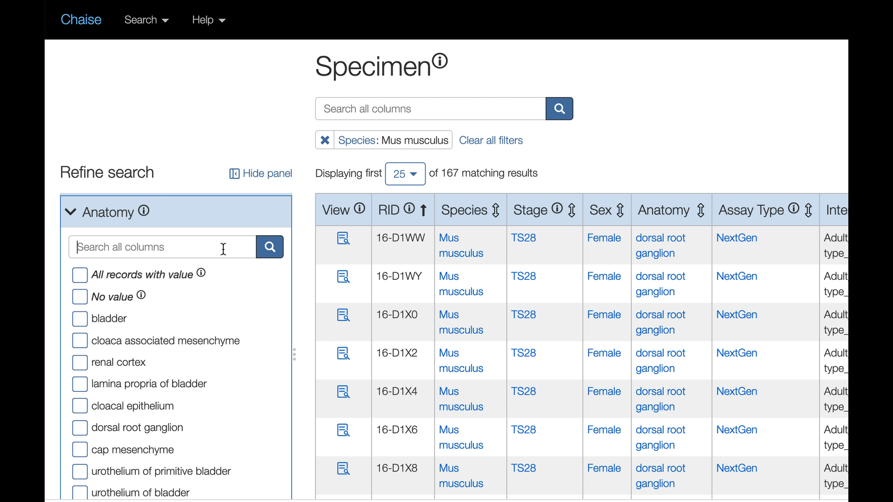
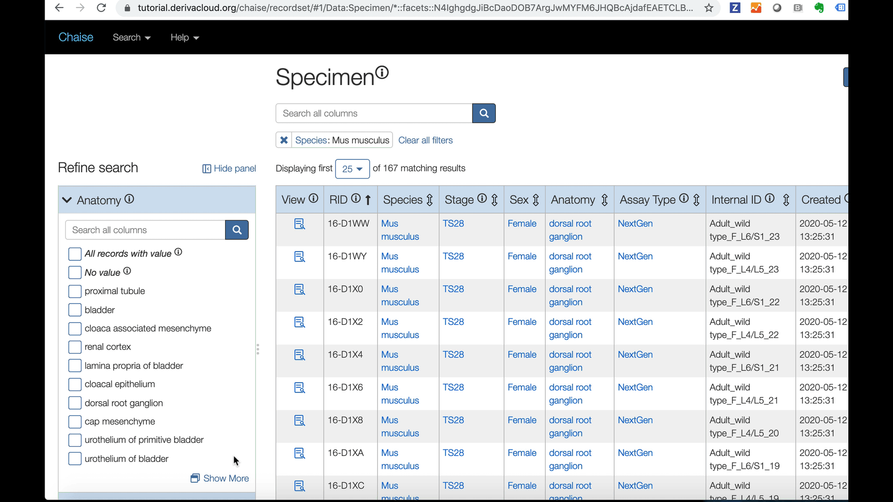
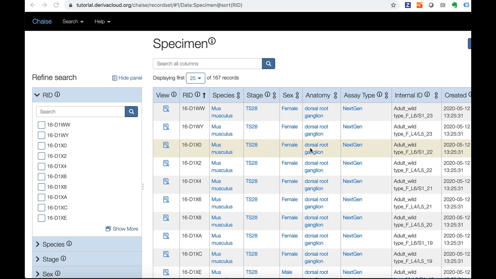
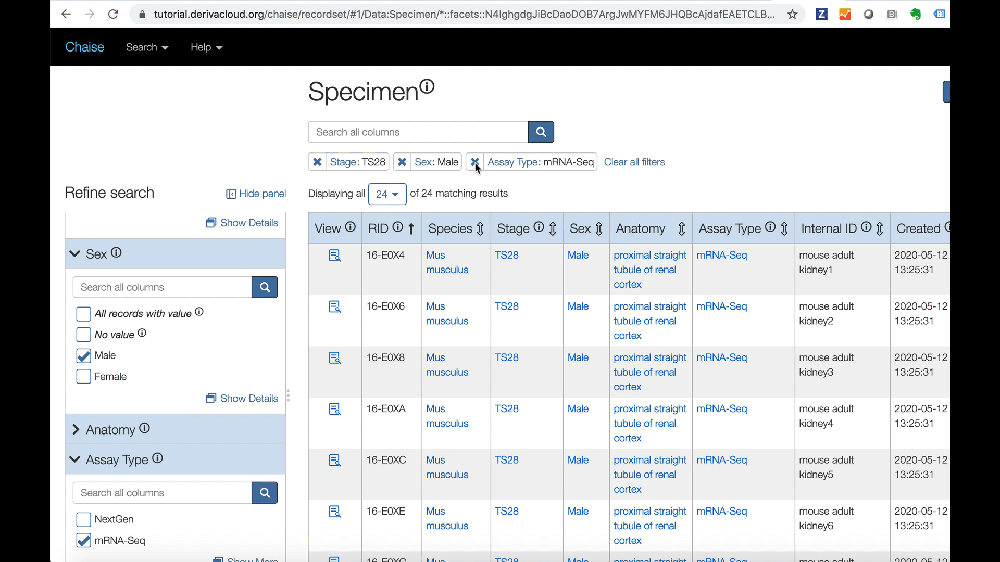
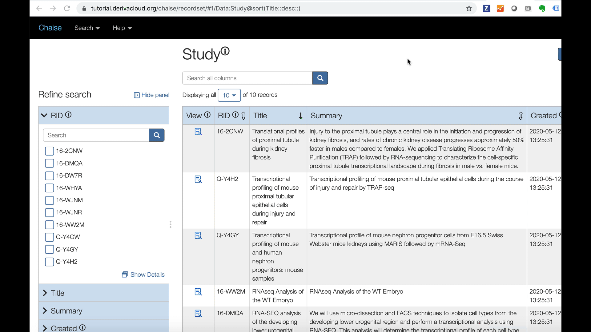
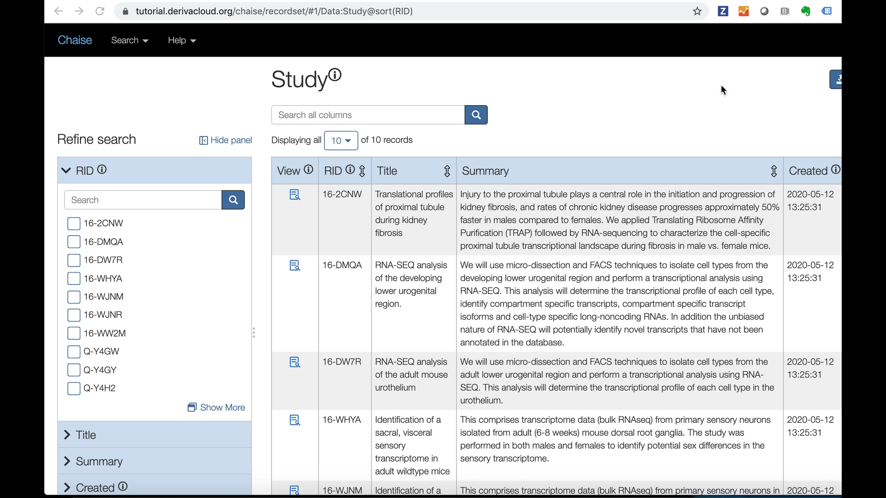

# Search page

Above is a typical search results example (sometimes referred to as the landing page). Common elements are:

1. Filtering sidebar
2. Filters (which display attributes chosen through the filtering sidebar)
3. Search bar above the results for free text search.
4. Search results based on filters.

## Using the filtering sidebar

The filtering sidebar is a configurable set of "filters" or "facets". In this example, Species and Stage (ie, anatomical age stage). Within each filter is a set of attributes that are represented in the data (ie, the Stage filter includes the attributes TS17, TS20, TS28, etc. - which represent Theiler stages).

### Selecting filters

Selecting and de-selecting attributes in any of the facets will filter the results to show data with those attributes.

The above screenshot shows that when you select the "mus musculus" attribute from the "Species" filter, and the "TS28" attribute from the "Stage" filter, the filter choices appear above the search results.

### Searching attribute within the sidebar

When there's more than a few attributes, you can use some searching techniques within the filtering sidebar to quickly find what you're looking for.

By default, Chaise displays attributes in RID (Record ID) order. Individual deployments may show by order of attributes with the most records associated with them.

Use the small search box within the filter to search across those attributes only. The following animation shows a user who wants to find "proximal tubule" within the "Anatomy" filter. Note how Chaise starts suggesting matches as the user types.

You can also click the "Show More" link to pull up a window with all of the attributes listed.

### Expanding/collapsing filters

If the filtering sidebar is long, you can manage which filters are shown by clicking the down and up arrow, as shown below, to expand and collapse the filters:

### Clearing filters

If you want to clear a filter, click the X icon next to the filter's name.

You can also click "Clear all filters" to remove them all.

## Main search results

The current search results are in the main body of the page. You can also browse and refine the results from this area.

### Searching across columns

Note the larger search field above the search results. Enter a keyword or key phrase to search across text in all of the visible columns.

### Sorting columns

Some columns are configured to be sort-able. To identify which columns you can sort, look for the double arrow icon and click to toggle the column sort between ascending and descending.

