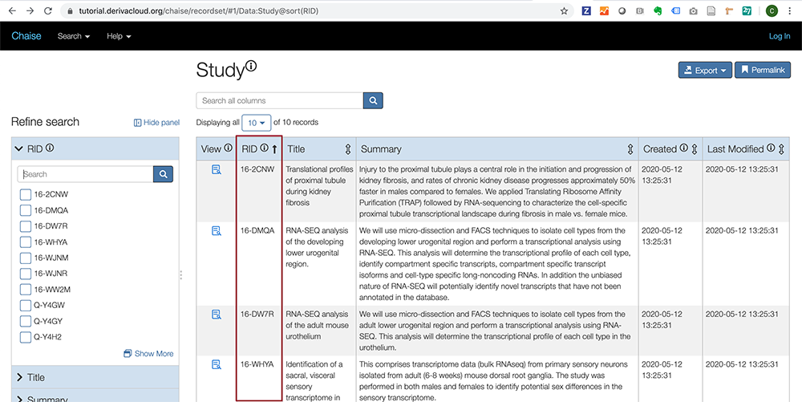
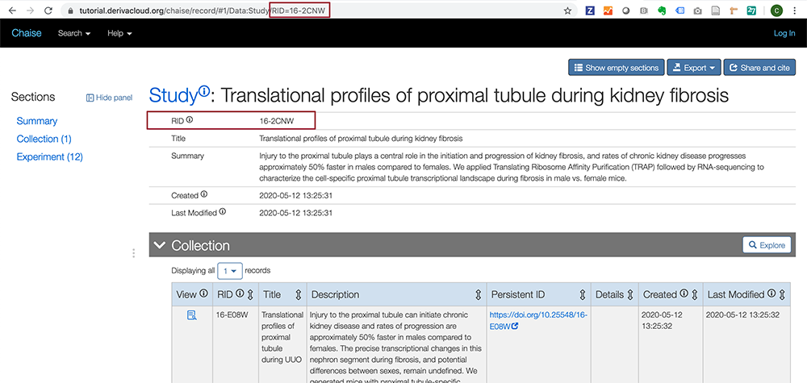
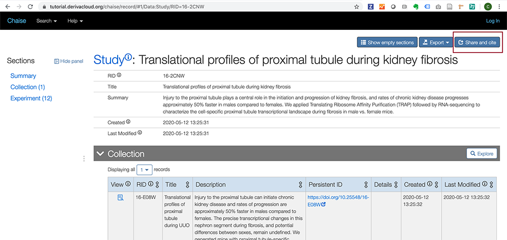
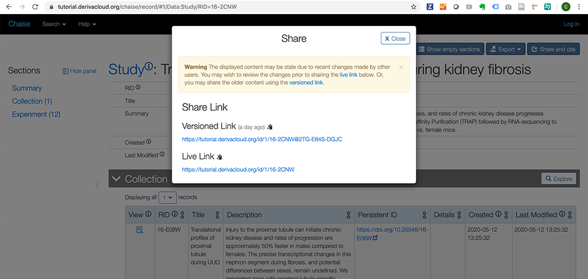

# Sharing and Citing Data

It is becoming more and more important to be able to specifically cite data. This is one of the reasons why DERIVA places such an emphasis on adhering to FAIR data principles.

To that end, every record in a DERIVA deployment is citable using Record IDs and Share links. A citation to a record in DERIVA is essentially equivalent to a citation to a paper or other scholarly work.

## Record IDs (RIDs)

Each record in Chaise has a corresponding Record ID (or RID). This is a resource identifier that is also a persistent identifier and can be used to cite data in the same way you cite publications.

The RID is displayed for every row of search results.

You can also find the RID on every record page, as well as at the end of the URL to a record page.

**IMPORTANT:** However, note that the URL of a record page does **not** hold the same citable significance as the "Share" links described below. When sharing DERIVA records, we strongly recommend using the Share links.

## Using Share links to cite any record

Each record displays the "Share and cite" button.

When you click this button, the "Share" window appears with links that are permanent identifiers, which include the RID. These URLs are **guaranteed** to always link to the current location of the data.

There are usually two types of Share links displayed:

* Versioned Link: References the state of the record at a certain point of time (a day ago).
* Live Link: References the state of the record at any point of time in the future.

REVIEW: This is not the correct description because I don't think that using a versioned link would actually take you to the old version of the record page. But I'm not clear what the practical usage is between the two types.

A full data citation should include the following information:

> Authors. Title. <em>[deployment-name]</em> Identifier (Publication Year)

Where:

* **Authors** - Include the contributors to the data. These usually include many or most of the members of the project that submitted the data. If you are unsure, list the PIs for the project that submitted the dataset as its authors.
* **Title** Use the title found at the top of the dataset's web page.
* **[deployment-name]** - Use the formal name of the deployment (for example, "FaceBase" or "GUDMAP") as the publisher or repository name.
* **Identifier** - Some reference management software simply call this "URL." Use the Share link found in the "Share and cite" menu.
* **Publication Year** - Use the year in the "Release Date" field.

Learn more about citing data at [DataCite](https://datacite.org/cite-your-data.html) and [Nature Research](https://www.nature.com/documents/nr-data-availability-statements-data-citations.pdf).

## Data Collections? Is this something that will become a common feature or a recommended feature for data modelers to add for any DERIVA deployment?

TBD
